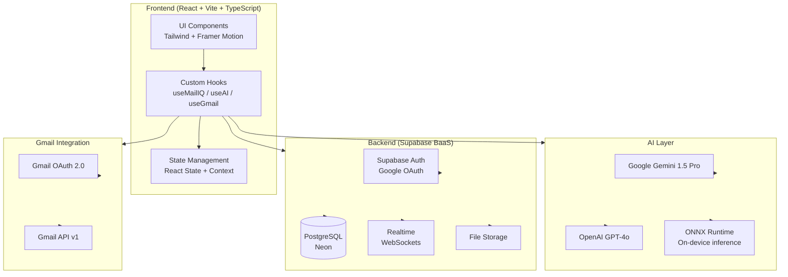
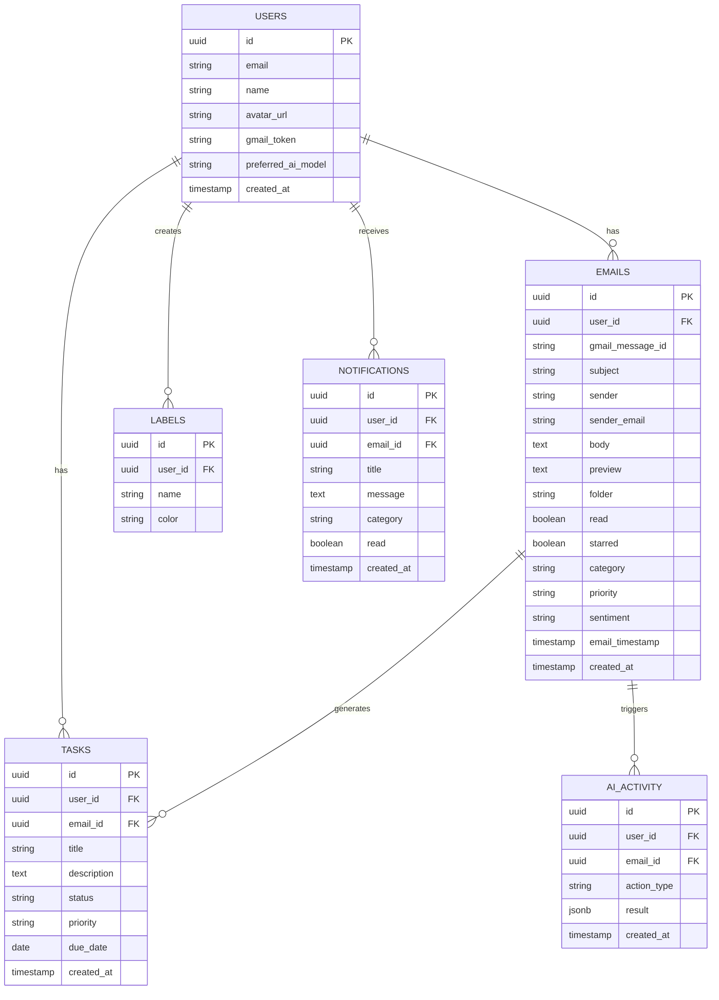

<div align="center">
  <br/>

  <!-- Logo & Title -->
  

  <h1>Mail-IQ 2.0</h1>

  <p><strong>AI-Powered Email Intelligence Platform</strong></p>
  <p><em>Transform your inbox from passive storage into intelligent productivity infrastructure.</em></p>

  <br/>

  <!-- Badges -->
  
  
  
  
  
  
  

  <br/>

  <!-- Links -->
  [🚀 Live Demo](https://mail-iq.vercel.app) · [📖 Docs](https://github.com/Devengoyal885/Mail-IQ/wiki) · [🐛 Report Bug](https://github.com/Devengoyal885/Mail-IQ/issues) · [✨ Request Feature](https://github.com/Devengoyal885/Mail-IQ/issues)

  <br/><br/>


</div>

---

## 🎯 Overview

Mail-IQ is a **production-grade AI Email Intelligence SaaS platform** that transforms how you interact with your inbox. Unlike traditional email clients that simply display messages chronologically, Mail-IQ uses advanced AI to:

- 🔍 **Analyze** every email for priority, sentiment, and key data
- 📅 **Extract** deadlines, meetings, and action items automatically
- 🤖 **Generate** smart replies, summaries, and labels using LLMs
- 📊 **Visualize** your email patterns with a rich analytics dashboard
- ✅ **Convert** emails into actionable tasks on a Kanban board
- 🔔 **Alert** you proactively before critical deadlines are missed

> *"Never Miss What Truly Matters"* — Mail-IQ acts as your personal AI email chief-of-staff.

---

## ✨ Feature Showcase

<table>
<tr>
<td width="50%">

### 📬 Intelligent Inbox
- Smart 3-panel layout (folder/list/reader)
- Priority-based email classification
- Sentiment analysis per email
- AI deadline extraction with alerts
- Custom labels with auto-labeling
- Star, archive, trash with animations

</td>
<td width="50%">

### 🤖 AI Intelligence Panel
- **Email Summarization** (short/medium/detailed)
- **Smart Reply Generator** (professional/friendly/formal)
- **Action Item Extraction** with 1-click task creation
- **Language Translation** (8+ languages)
- **Confidence scoring** for AI predictions
- Powered by Gemini 1.5 Pro / GPT-4o

</td>
</tr>
<tr>
<td>

### 📊 Analytics Dashboard
- Weekly/monthly email activity charts
- Category & priority breakdowns
- Sentiment analysis visualization
- Productivity score tracking
- High-priority email spotlight
- Built with Recharts

</td>
<td>

### ✅ Task Board (Kanban)
- Auto-extracted tasks from emails
- 3-column drag-friendly board (Todo / In Progress / Done)
- Priority tags and deadline badges
- Email-linked task context
- One-click status updates

</td>
</tr>
<tr>
<td>

### 🔍 Advanced Search
- Natural language search queries
- Multi-filter search (sender, priority, attachments, date)
- Quick search shortcuts
- AI-enhanced result summaries

</td>
<td>

### 💬 AI Chat Assistant
- Chat with your entire inbox
- Ask: *"Show urgent emails this week"*
- Ask: *"Find interview emails from Google"*
- Ask: *"What deadlines do I have?"*
- Context-aware, inbox-grounded responses

</td>
</tr>
<tr>
<td>

### 📨 Smart Compose
- AI-assisted email composition
- Reply with context pre-filled
- Attachment support
- Template-based smart starts

</td>
<td>

### ⚙️ Settings & Customization
- Dark / Light / System theme
- AI model preference (Gemini / GPT-4)
- Summary length control
- Font size adjustment
- Notification preferences

</td>
</tr>
</table>

---

## 🏗️ Architecture



---

## 🗄️ Database Schema



---

## 📁 Project Structure

```
Mail-IQ/
├── public/
│   └── models/              # ONNX models for on-device inference
├── src/
│   ├── components/
│   │   ├── Sidebar.jsx
│   │   ├── ProtectedRoute.jsx
│   │   └── ...
│   ├── context/
│   │   └── AuthContext.jsx  # Firebase/Supabase auth context
│   ├── hooks/
│   │   ├── useEmails.js
│   │   ├── useAI.js
│   │   └── useGmail.js
│   ├── lib/
│   │   ├── supabase.js      # Supabase client
│   │   └── gemini.js        # AI client
│   ├── pages/
│   │   ├── LoginPage.jsx
│   │   ├── DashboardPage.jsx
│   │   ├── UploadPage.jsx
│   │   └── SavedProjectsPage.jsx
│   ├── styles/
│   │   └── index.css
│   ├── workers/
│   │   └── emailWorker.js   # Web worker for background processing
│   ├── App.jsx
│   └── main.jsx
├── .env.example
├── .gitignore
├── index.html
├── package.json
├── vite.config.js
└── README.md
```

---

## 🚀 Quick Start

### Prerequisites

- Node.js 18+
- npm or pnpm
- Supabase account (free tier works)
- Google Cloud Console project (for Gmail OAuth)
- Gemini API key (optional, for AI features)

### Installation

```bash
# 1. Clone the repository
git clone https://github.com/Devengoyal885/Mail-IQ.git
cd Mail-IQ

# 2. Install dependencies
npm install

# 3. Set up environment variables
cp .env.example .env
# Edit .env with your credentials (see Environment Variables section)

# 4. Start development server
npm run dev
```

Visit `http://localhost:5173` 🎉

---

## 🔧 Environment Variables

Create a `.env` file based on `.env.example`:

```env
# ── Supabase ─────────────────────────────────────
VITE_SUPABASE_URL=https://your-project.supabase.co
VITE_SUPABASE_ANON_KEY=your_supabase_anon_key

# ── Gmail OAuth ───────────────────────────────────
VITE_GMAIL_CLIENT_ID=your_google_oauth_client_id.apps.googleusercontent.com
VITE_GMAIL_REDIRECT_URI=http://localhost:5173/auth/callback

# ── AI APIs ───────────────────────────────────────
VITE_GEMINI_API_KEY=your_gemini_api_key
VITE_OPENAI_API_KEY=your_openai_api_key          # Optional

# ── App Config ───────────────────────────────────
VITE_APP_URL=http://localhost:5173
VITE_APP_NAME=Mail-IQ
```

> [!CAUTION]
> **Never commit your `.env` file to version control!** The `.gitignore` is configured to exclude it. Always use `.env.example` as the template.

---

## 📡 API Documentation

### Gmail Integration

Mail-IQ uses Gmail API v1 with OAuth 2.0 scopes:
- `gmail.readonly` — Read emails
- `gmail.modify` — Archive, label, mark read
- `gmail.compose` — Send and reply

### AI Endpoints

| Feature | Model | Avg Latency |
|---------|-------|-------------|
| Email Summary | Gemini 1.5 Flash | ~800ms |
| Smart Reply | Gemini 1.5 Pro | ~1.2s |
| Priority Detection | On-device ONNX | ~50ms |
| Deadline Extraction | Gemini 1.5 Flash | ~600ms |
| Sentiment Analysis | On-device ONNX | ~30ms |
| Translation | Gemini 1.5 Pro | ~1.5s |

### Supabase Real-time

```javascript
// Subscribe to new emails
const channel = supabase
  .channel('emails')
  .on('postgres_changes', { event: 'INSERT', schema: 'public', table: 'emails' }, (payload) => {
    // Handle new email
  })
  .subscribe();
```

---

## 🚢 Deployment

### Vercel (Recommended)

```bash
npm install -g vercel
vercel --prod
```

Set environment variables in Vercel Dashboard → Project Settings → Environment Variables.

### Netlify

```bash
npm run build
# Upload dist/ folder to Netlify, or connect GitHub repo
```

### Railway / Render

```bash
# Build command
npm run build

# Start command  
npm run preview
```

### Neon PostgreSQL Setup

```sql
-- Run in Neon SQL editor
CREATE TABLE users (
  id UUID PRIMARY KEY DEFAULT gen_random_uuid(),
  email TEXT UNIQUE NOT NULL,
  name TEXT,
  created_at TIMESTAMPTZ DEFAULT NOW()
);

CREATE TABLE emails (
  id UUID PRIMARY KEY DEFAULT gen_random_uuid(),
  user_id UUID REFERENCES users(id) ON DELETE CASCADE,
  subject TEXT NOT NULL,
  sender TEXT,
  sender_email TEXT,
  body TEXT,
  folder TEXT DEFAULT 'inbox',
  read BOOLEAN DEFAULT FALSE,
  starred BOOLEAN DEFAULT FALSE,
  priority TEXT,
  sentiment TEXT,
  email_timestamp TIMESTAMPTZ,
  created_at TIMESTAMPTZ DEFAULT NOW()
);

-- Enable Row Level Security
ALTER TABLE emails ENABLE ROW LEVEL SECURITY;
CREATE POLICY "Users can only see their own emails" ON emails
  FOR ALL USING (auth.uid() = user_id);
```

---

## 🔒 Security

Mail-IQ follows security-first architecture:

| Layer | Implementation |
|-------|---------------|
| **Authentication** | Supabase Auth + Google OAuth 2.0 |
| **Authorization** | Row Level Security (RLS) on all tables |
| **API Security** | Rate limiting + input validation |
| **Data Privacy** | User-isolated data, no cross-user access |
| **Secrets** | Environment variables only, never in code |
| **XSS Protection** | React's built-in escaping + CSP headers |
| **SQL Injection** | Parameterized queries via Supabase client |

---

## 🗺️ Roadmap

### ✅ Phase 1 — Foundation (Current)
- [x] Gmail OAuth integration
- [x] AI email summarization
- [x] Deadline extraction & alerts
- [x] Priority detection
- [x] Task extraction
- [x] Kanban board
- [x] Analytics dashboard
- [x] AI chat assistant
- [x] Smart compose
- [x] Dark/light theme

### 🚧 Phase 2 — Expansion (Q3 2024)
- [ ] Outlook / Microsoft 365 integration
- [ ] Mobile app (React Native)
- [ ] Voice commands (Web Speech API)
- [ ] PWA with offline support
- [ ] Real-time WebSocket sync
- [ ] Collaborative inbox (team accounts)

### 🔮 Phase 3 — Enterprise (Q4 2024)
- [ ] Team management dashboard
- [ ] Custom AI fine-tuning
- [ ] SSO (SAML 2.0)
- [ ] Admin analytics panel
- [ ] Workflow automation
- [ ] Zapier / Make integration

### 🌟 Phase 4 — AI Agent (2025)
- [ ] Fully autonomous email agent
- [ ] Auto-response with approval flow
- [ ] Meeting scheduling via email
- [ ] Multi-inbox management
- [ ] Personal AI email assistant

---

## 🤝 Contributing

Contributions are welcome! Please read our [Contributing Guide](CONTRIBUTING.md) and [Code of Conduct](CODE_OF_CONDUCT.md).

```bash
# Fork the repository, then:
git checkout -b feat/your-amazing-feature
git commit -m 'feat: add amazing feature'
git push origin feat/your-amazing-feature
# Open a Pull Request
```

See [CONTRIBUTING.md](CONTRIBUTING.md) for detailed guidelines.

---

## 📸 Screen Desription

| View | Description |
|------|-------------|
| **Inbox** | Three-panel layout with AI extraction chips |
| **Dashboard** | Analytics with Recharts visualizations |
| **AI Panel** | Summary, smart reply, task extraction, translation |
| **Tasks** | Kanban board from email action items |
| **Search** | Natural language search with filters |
| **AI Chat** | Conversational inbox assistant |

---
## 🚀 Project Status & Repository Structure

### Production Version (This Repository)

This repository contains the **actual MailIQ source code**, architecture, backend integrations, AI workflows, and production-ready implementation currently under active development.

MailIQ was designed as a real-world AI-powered email intelligence platform with features such as:

* AI Email Categorization
* Smart Priority Detection
* Deadline & Action Item Extraction
* Email Summarization
* Unified Communication Intelligence
* User Authentication & Personalization
* Analytics Dashboard
* Productivity Insights

### Why Isn't It Publicly Deployed?

Deploying MailIQ as a fully functional SaaS product requires ongoing infrastructure and operational costs, including:

* AI Model API Usage
* Authentication Services
* Database Hosting
* Email Processing Infrastructure
* Cloud Storage
* Monitoring & Security Services

As a student-built project, maintaining these production services continuously is currently not financially feasible.

### Demo Version

To showcase the concept, design, workflow, and user experience of MailIQ, a separate demo prototype has been created.

🔗 **Live Demo:** https://mailiq.netlify.app/

🔗 **Demo Repository:** https://github.com/Devengoyal885/MailIQ-demo

The demo illustrates the intended functionality and user interface but does not include all production integrations and paid infrastructure required for real-world deployment.

### Future Roadmap

The goal is to launch MailIQ as a fully hosted platform once sufficient resources, sponsorship, partnerships, or funding become available.

Until then, this repository serves as the primary development repository containing the actual implementation and ongoing research behind the project.

---

## 👨‍💻 Author

<table>
<tr>
<td align="center">
  
  <br/>
  <strong>Deven Goyal</strong>
  <br/>
  <em>Full Stack AI Engineer</em>
  <br/>
  <a href="https://devengoyal.netlify.app">🌐 Portfolio</a> ·
  <a href="https://github.com/Devengoyal885">💻 GitHub</a> ·
  <a href="https://linkedin.com/in/deven-goyal">💼 LinkedIn</a>
</td>
</tr>
</table>

---


## 📄 License

This project is licensed under the **MIT License** — see [LICENSE](LICENSE) for details.

```
MIT License — Copyright (c) 2024 Deven Goyal
Permission is hereby granted, free of charge, to any person obtaining a copy...
```

---

<div align="center">
  <p>Made with ❤️ by <a href="https://devengoyal.netlify.app">Deven Goyal</a></p>
  <p>
    <a href="https://github.com/Devengoyal885/Mail-IQ/stargazers">⭐ Star this project if it helped you!</a>
  </p>
  <br/>
  <sub>Mail-IQ — Never Miss What Truly Matters</sub>
</div>
